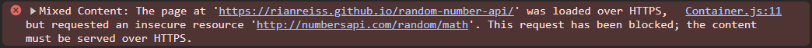

# Random Number Generator

Welcome to the Random Number Generator mini-project!

This project aims to generate random math facts using the [NumberApi](http://numbersapi.com/) API.

## Demo

Check out the live demo below to experience the Random Number Generator in action!

## Technologies Used
- React JS 
- Javascript 
- SCSS 
- API Request

## Known Issue

Due to security restrictions, GitHub Pages blocks HTTP requests. As a result, the API requests to NumberApi may not work as expected when accessing the project through GitHub Pages. If you encounter this issue, you can try the demo on a local server to fully experience the functionality.

This is the console error.

You can try that error by clicking the **GitHub Pages** link below.

[Random Number Generator](https://rianreiss.github.io/random-number-api/)

## Getting Started

To set up the project locally, follow these steps:

1. Clone the repository to your local machine.
2. Navigate to the project directory.
3. Install dependencies using `npm install`.
4. Start the development server using `npm start`.
5. Access the application in your web browser at `http://localhost:3000`.   